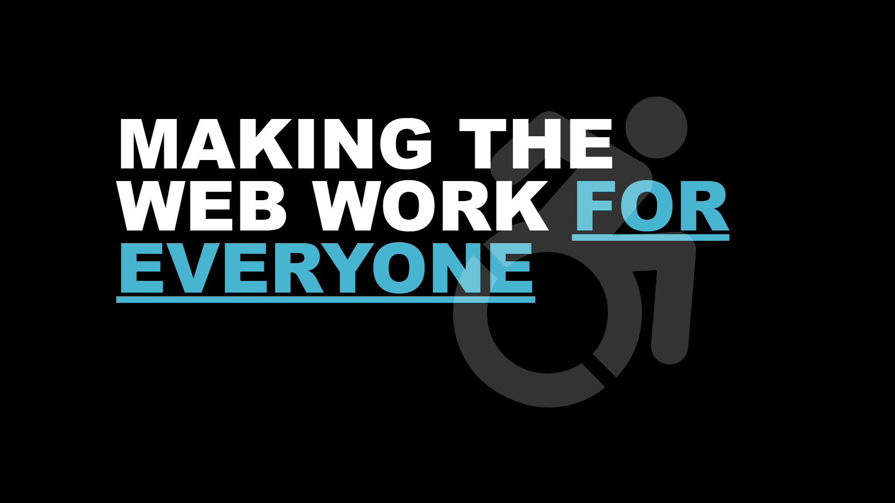

## Making the Web Work for Everyone

### Sections

1. [What is digital accessibility?](https://jasonwebb.github.io/making-the-web-work-for-everyone-talk/#/3)
2. [Why does it matter?](https://jasonwebb.github.io/making-the-web-work-for-everyone-talk/#/11)
3. [How do I build accessible stuff?](https://jasonwebb.github.io/making-the-web-work-for-everyone-talk/#/17)
4. [Live demos!](https://jasonwebb.github.io/making-the-web-work-for-everyone-talk/#/24)
5. [Testing for accessibility](https://jasonwebb.github.io/making-the-web-work-for-everyone-talk/#/26)
6. [How can *you* make things better?](https://jasonwebb.github.io/making-the-web-work-for-everyone-talk/#/32)
7. [Learning more](https://jasonwebb.github.io/making-the-web-work-for-everyone-talk/#/36)

### Code samples

1. Page structure - how landmark tags affect screen reader usability
   * [Inaccessible version](https://codepen.io/jasonwebb/pen/wvwEorp/left?editors=1000)
   * [Accessible version](https://codepen.io/jasonwebb/pen/ZEzMBRZ/left?editors=1000)
2. Forms - using `<label>`s, grouping controls using `<fieldset>`, handling and associating valiation errors, and more
   * [Inaccessible version](https://codepen.io/jasonwebb/pen/VwZGwpQ/left/?editors=1000)
   * [Accessible version](https://codepen.io/jasonwebb/pen/XWrPWGg/left?editors=1000)

## Packages used

* [Reveal.js](https://github.com/hakimel/reveal.js/)
* [reveal-a11y](https://github.com/marcysutton/reveal-a11y) plugin by [Marcy Sutton](https://github.com/marcysutton)
* Custom theme under [`./revealjs/css/theme/source/accessible360--dark.scss`](https://github.com/jasonwebb/making-the-web-work-for-everyone-talk/blob/master/revealjs/css/theme/source/accessible360--dark.scss)